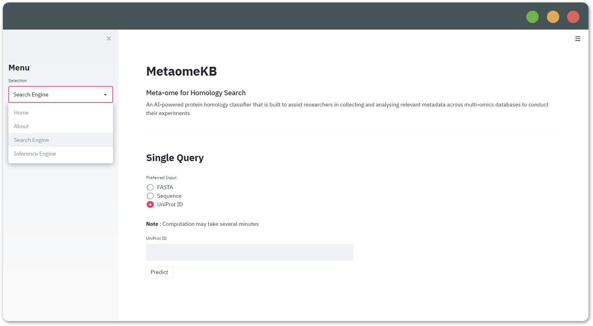

# MetaomeKB
Meta-ome for Homology Search

Web App : https://metaomekb.herokuapp.com/

An AI-powered protein homology classifier that is built to assist researchers in collecting 
and analysing relevant metadata across multi-omics databases to conduct their experiments.



Setting up environment and installing libraries locally:
```
# Setting up a virtual environment
python -m venv env

# Activating the virtual environment
# Mac OS / Linux
source env/bin/activate

# Windows
.\env\Scripts\activate

# Installing packages using Pip
pip install -r requirements.txt
```

For local hosting, use the following docker command:
```
docker run -p 80:8080 -e PORT=8080 .
```
